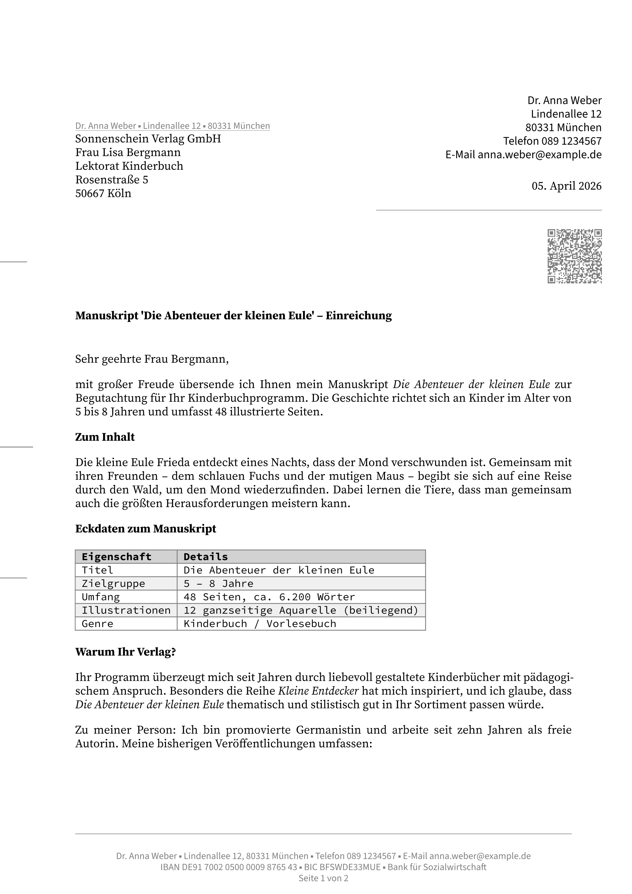

# din5008a

A [Typst](https://typst.app) template for German business letters following **DIN 5008 Form A**.



## Features

- Full DIN 5008 Form A layout with exact measurements per standard
- Address field at 27 mm (Briefkopffeld), Anschriftzone at 44.7 mm
- Informationsblock: 32 mm top, 125 mm left, 75 mm wide (date included)
- Fold marks at 87 mm / 192 mm, punch hole at 148.5 mm
- **Source Serif 4** for body text, address, date, and subject (11 pt)
- **Source Sans 3** for footer, return address, and follow-up header (9 pt, 50% gray)
- 150% line spacing, one blank line paragraph spacing
- Optional vCard QR code in Informationsblock
- Centered footer with contact info, bank details, and page counter
- Unordered list bullets as small black squares (▪)

## Quick Start

```typst
#import "@local/din5008a:0.1.1": din5008a, bullet

#show: din5008a.with(
  sender: (
    name: "Dr. Anna Weber",
    street: "Lindenallee 12",
    city: "80331 Muenchen",
    phone: "089 1234567",
    email: "anna.weber@example.de",
    iban: "DE91 7002 0500 0009 8765 43",
    bic: "BFSWDE33MUE",
    bank: "Bank fuer Sozialwirtschaft",
  ),
  recipient: (
    "Sonnenschein Verlag GmbH",
    "Frau Lisa Bergmann",
    "Rosenstrasse 5",
    "50667 Koeln",
  ),
  date: "05. April 2026",
  subject: "Manuskript - Einreichung",
)

Sehr geehrte Frau Bergmann,

mit grosser Freude uebersende ich Ihnen mein Manuskript.

Mit herzlichen Gruessen

Dr. Anna Weber
```

## Parameters

| Parameter | Type | Default | Description |
|-----------|------|---------|-------------|
| `sender` | dictionary | `(:)` | Sender: `name`, `street`, `city`, `phone`, `email`, `iban`, `bic`, `bank`, `qr` (bool) |
| `recipient` | array | `()` | Recipient address lines |
| `date` | string | `none` | Date (shown in Informationsblock) |
| `subject` | string | `none` | Subject line (bold) |
| `closing` | string | `none` | Closing phrase (e.g. "Mit freundlichen Grüßen") |
| `signature` | content | `none` | Signature image: `image("unterschrift.svg")` (.svg, .png, .jpg) — scaled to 2 lines |
| `fold-marks` | bool | `true` | Show fold and punch hole marks |

## DIN 5008 Form A Layout

```
 ┌──────────────────────────────────────────────┐
 │  Briefkopffeld (frei gestaltbar)             │ 27mm
 ├────────────────────┬─────────────────────────┤
 │  Rücksendeangabe   │                         │
 │  Zusatz/Vermerke   │  Informationsblock      │ 32mm
 │  ─ ─ ─ ─ ─ ─ ─ ─  │  Name, Adresse, Tel,    │
 │  Anschriftzone     │  E-Mail, Datum          │
 │  (6 Zeilen)        │  ───────────────────     │
 │  85mm              │  QR-Code (optional)     │ 72mm
 ├────────────────────┤  75mm ab 125mm          │
 │                    ├─────────────────────────┤
 │                                              │
 │  Betreff (fett)                              │ 103.46mm
 │  Anrede + Textkörper                         │
 │  (Source Serif 4, 11pt, 150% Zeilenabstand)  │
 │                                              │
─┤ Faltmarke 1                                  │ 87mm
 │                                              │
─┤ Lochmarke                                    │ 148.5mm
 │                                              │
─┤ Faltmarke 2                                  │ 192mm
 │                                              │
 ├──────────────────────────────────────────────┤
 │  Footer (Source Sans 3, 9pt, zentriert)      │
 │  Kontakt ▪ Bank ▪ Seite x von y             │
 └──────────────────────────────────────────────┘
  │← 25mm →│                          │← 20mm →│
```

## Requirements

- [Typst](https://typst.app) >= 0.12
- [Source Sans 3](https://github.com/adobe-fonts/source-sans) (static, not variable)
- [Source Serif 4](https://github.com/adobe-fonts/source-serif) (static, not variable)

## License

[MIT](LICENSE)
